% Machine Learning Project
% Human Activity Recognition using Machine Learning Techniques

---------------------------

## About Our Project

- **Task** : Predict the activity **and** the person performing the activity

- **Performance**: Percentage of actions and person performing the activity correctly classified

- **Experience**: PAMAP2 data set of labeled IMU readings available from the UCI Machine Learning Repository

---------------------------

## PAMAP2 Data Set

- A Physical Activity Monitoring Dataset
- 3 wireless inertial measurement units (IMU):
    - sampling frequency: 100Hz  on wrist, chest and ankle
    - records temperature, acceleration, 3D-magnetometer data, 3D-gyroscope data, orientation etc...

- 1 heart rate monitor with sampling frequency of ~9Hz

---------------------------

## Activities Include ...

Lying, Sitting, Standing, Ironing, Vacuuming,
Walking Upstairs
Walking Downstairs, Normal Walk, Nordic Walk,
Cycling, Running

---------------------------

## Model Construction Methods

1. Classify Subject (Person) --> Classify Action of the Subject

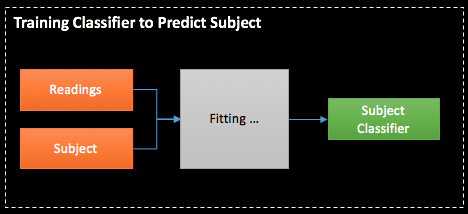

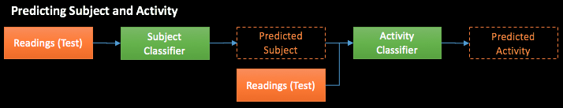

---------------------------

## Model Construction Methods

2. Classify Action --> Classify Subject(Person)

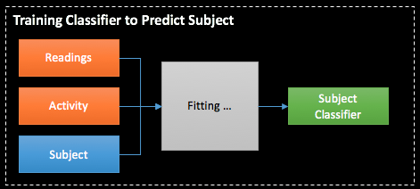

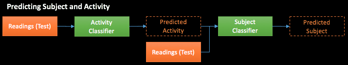

---------------------------

## Model Construction Methods

3. Classify Both Subject and Action Simultaneously

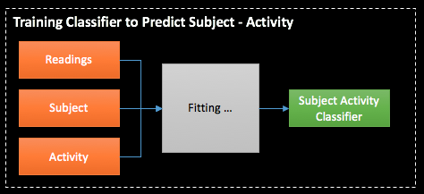

---------------------------

## Data Preparation

* **Missing Values** - Missing values caused by different frequencies. Back fill or Forward fill the empty value

* **Invalid Data** - Acceleration of ±6g is saturated

* **Derived Subject-Activity** - Concatenate subject and activity

---------------------------

## Data Exploration

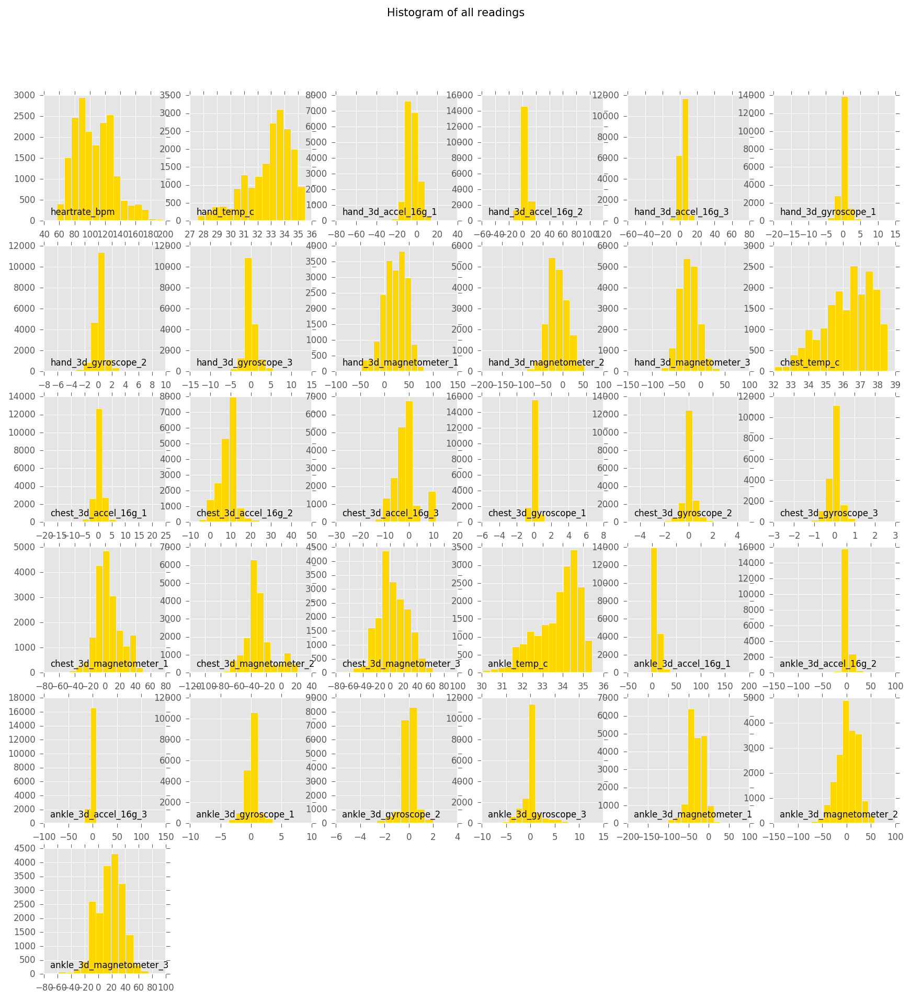

---------------------------

These variables were have greater variance

* `heartrate_bpm`
* `hand_temp_c`
* `chest_temp_c`
* `ankle_temp_c`
* `*_magnetometer_*`

We will return to the after fitting the models

---------------------------

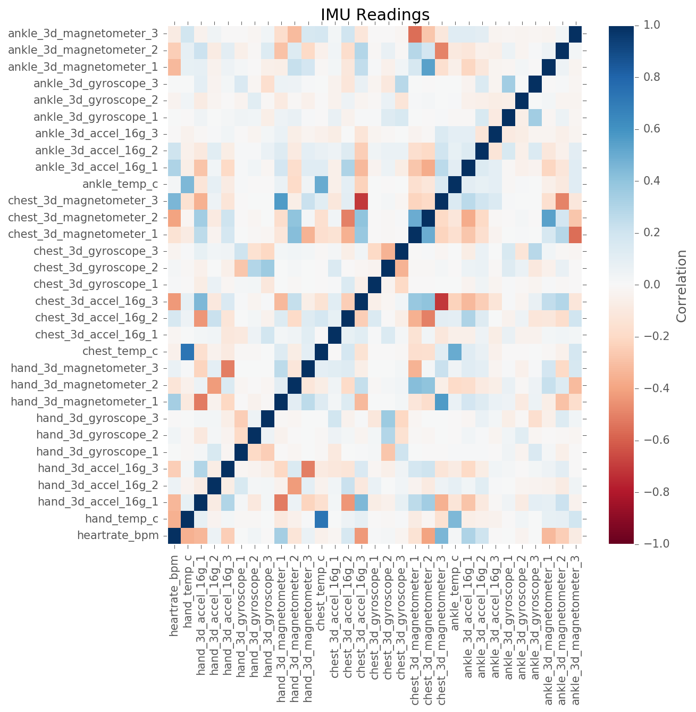

---------------------------

Strong correlations between several variables:

* `chest_temp_c` and `hand_temp_c`
* `chest_3d_magnetometer` and `chest_3d_accel`
* `ankle_3d_magnetometer` and `chest_3d_magnetometer`

---------------------------

## Principal Component Analysis

Most of the variance can be explained by the first 3 components

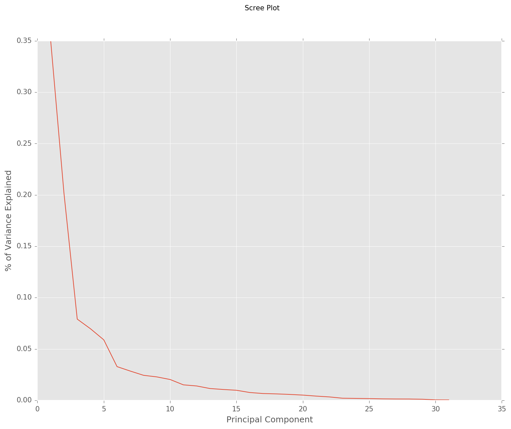

---------------------------

* PC1 has the strongest correlations with `chest_temp_c` , `hand_temp_c` , and `ankle_temp_c`
* PC2 has the strongest correlations with `heartrate_bpm`
* PC2 has the strongest correlations with `ankle_temp_c`

---------------------------

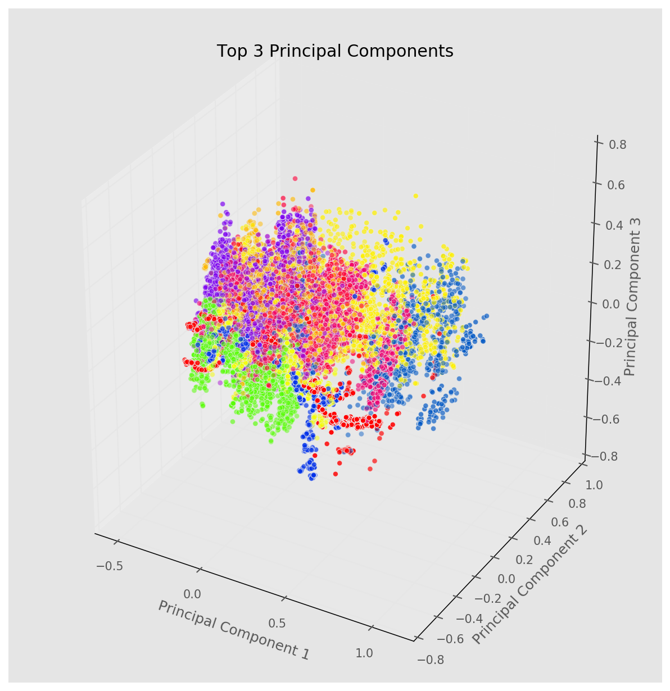

---------------------------

## Model Comparison

* **Accuracy** and **Computational Complexity** were the primary considerations

* The classifiers used were the following:
    * SVM with Stochastic Gradient Descent (SGD)
    * Gaussian Naive Bayes
    * Multi-output Classifier using the best model from initial comparison

* SVM without SGD (Linear Kernel) was ran but model fitting took more than 5 hours and did not complete.

---------------------------

## SVM with SGD

* May be stuck in a local optima.
* Hence model fitted 100 times.
* Results are shown below.

Method | Accuracy (mean) | Accuracy (max) | Accuracy (min) | Average Time Taken (seconds)
--- | --- | --- | --- | ---
S -> A | 0.48 | 0.44 | 0.52 | (S+A) 11.11 + 14.54 = 25.65
A -> S | 0.48 | 0.43 | 0.53 | (A+S) 15.19 + 11.28 = 26.47
Both | 0.63 | 0.58 | 0.67 | 113.79

---------------------------

## SVM with SGD

* To find optimal smoothing parameter alpha, Grid Search was used
* Alpha values tried `0.0001,0.001,0.01,0.1,1`
* 2-fold Cross Validation was used with Grid Search
* Model fitted 60 times (took more than 12 hours)
* Best alpha at 0.1
* Results are shown below

Method | Accuracy (mean) | Accuracy (max) | Accuracy (min) | Average Time Taken (seconds)
--- | --- | --- | --- | ---
Both | 0.63 | 0.49 | 0.68 | 621.75

---------------------------

##Gaussian Naive Bayes

* Chosen as it is performant in real-world situations
* Variables are scaled as measurements were in different scales
* PCA was done for initial model

Method | Accuracy | Time Taken (seconds)
--- | --- | ---
S -> A | 0.40 | (S+A) 0.50 + 0.52 = 1.02
A -> S | 0.50 | (A+S) 0.63 + 0.59 = 1.21
Both | 0.64 | 0.74

---------------------------

* 10 times faster than the SVM model in the S -> A and A -> S conditions
* Over 100 times faster under the 'Both' condition.
* Another Gaussian Naive Bayes model was fitted, but this time without PCA

---------------------------

* Accuracy increased to 0.96 with all variables
* Takes more than double the time to train (1.81s vs 0.74s)
* Time to train traded off for accuracy

Method | Accuracy | Time Taken (seconds)
--- | --- | ---
S -> A | 0.54 | (S+A) 1.36 + 1.27 = 2.63
A -> S | 0.54 | (A+S) 1.43 + 1.48 = 2.91
Both | 0.96 | 1.81

---------------------------

## Multi-output Classifier Comparison

* `sklearn`'s multi-output classifier used with Gaussian Naive Bayes
* Less performant than the standard classifier in terms of accuracy and duration.
* Classifies by fitting 1 classifier per target.
* 1 classifier will be fitted to predict Activity and 1 classifier will be fitted to predict Subject.

Method | Accuracy | Time Taken (seconds)
--- | --- | ---
Multi-Output | 0.54 | 2.28

---------------------------

## k-fold Cross Validation

* 10 fold cross validation was ran
* The average accuracy for the 10 folder is 0.9363
* Does not show any indications of overfitting

---------------------------

## Visualizing the Classifications

* Colors denote the various subject - activities
* Circles denote correctly predicted classes
* Inverted triangles denote incorrectly predicted classes

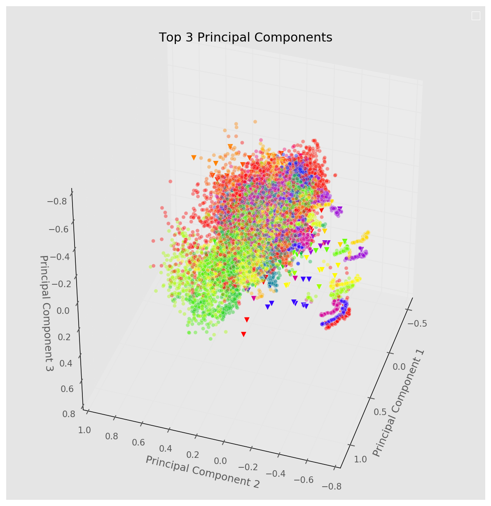

---------------------------

## Visualizing the Classifications

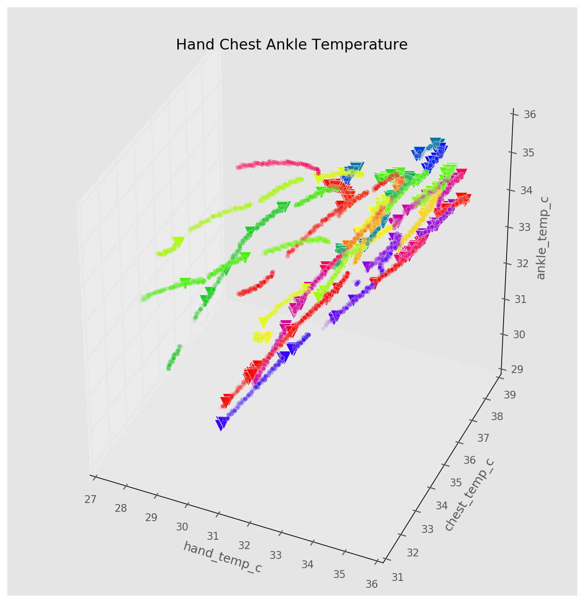

---------------------------

## Visualizing the Classifications

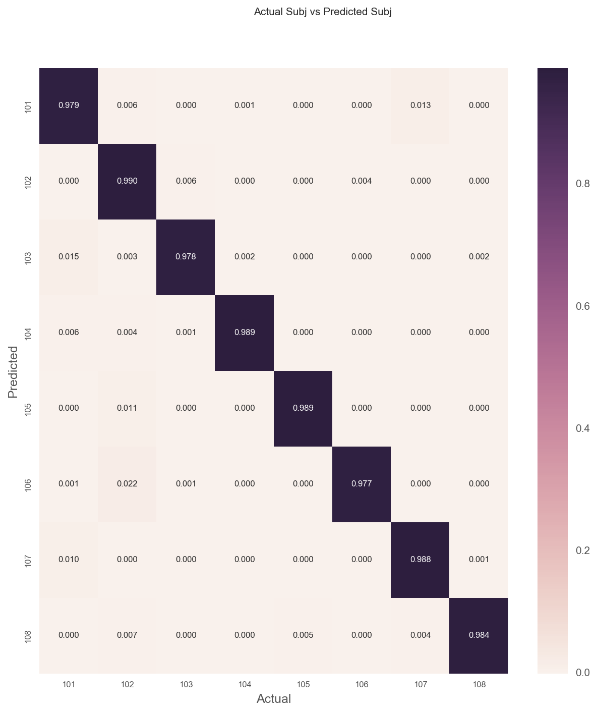

---------------------------

## Visualizing the Classifications

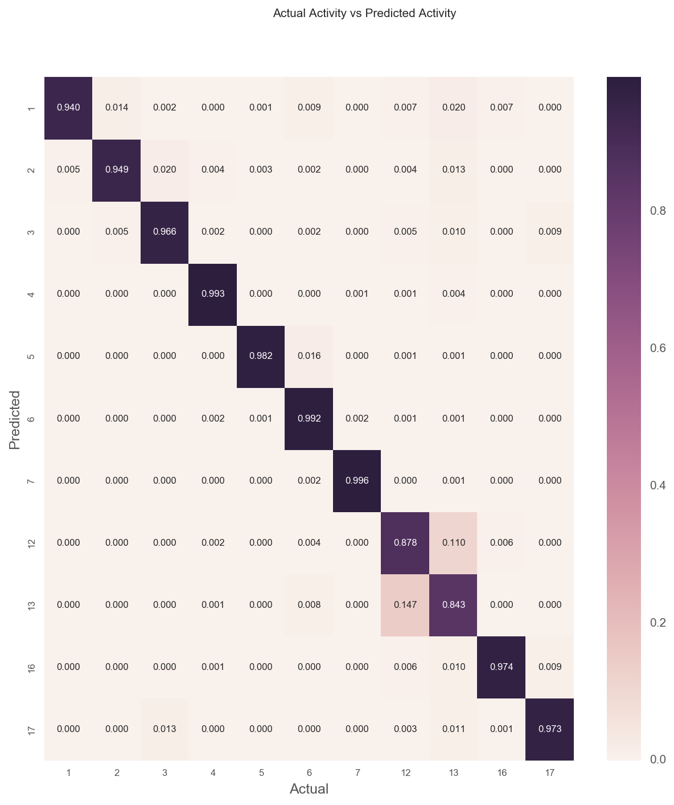

---------------------------

* Classifier has problems classifying activities 12 and 13
* Corresponds to Ascending Stairs and Descending Stairs
* These 2 activities appears to be quite similar which explains the error in classification
* Lastly, we plot the subject-activity classification

---------------------------

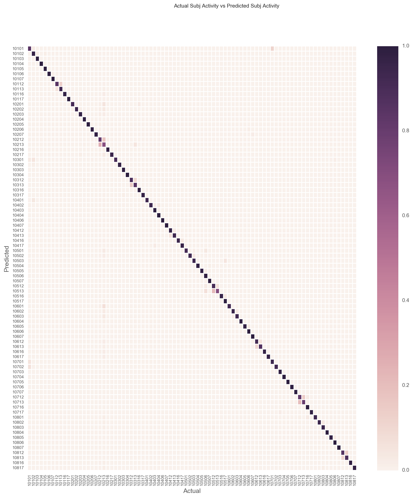

---------------------------

## Key Takeaways

* The selected classifier (Gaussian Naive Bayes) have problems classifying Ascending and Descending Stairs.

* Gaussian Naive Bayes model without PCA tends to perform better, in terms of both accuracy and efficiency.

* Especially so when sample size is large

* Linear SVM without SGD was very slow to train on this data set.

* SVM with SGD provided a performance boost, but could not compare with Gaussian Naive Bayes in terms of accuracy

---------------------------

## Key Takeaways

* Concatenating the multiple outputs into one target variable with more unique levels performs better than trying to predict the target variables as standalone outputs.

* In the application of machine learning algorithms, different trade offs such as accuracy, time taken to train needs to be considered.

---------------------------

> Why did the naive Bayesian suddenly feel patriotic when he heard fireworks?
>
> "He assumed independence."

<a href='https://github.com/junquant/mlproject' target='_blank'>View on Github</a>

`www.github.com/junquant/mlproject`
