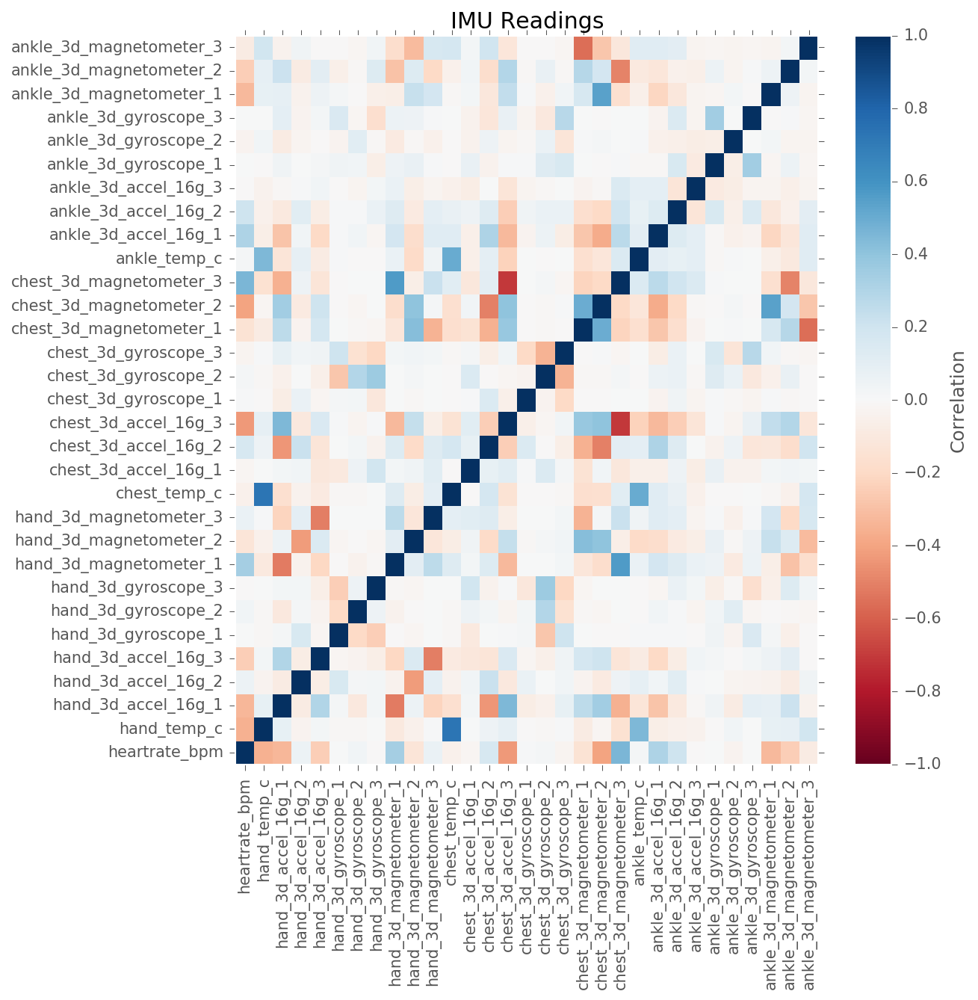

% Human Activity Recognition using Machine Learning techniques
% THAM JUN QUAN, THOMAS JIANG CHENYANG, AUSTIN ZHANG YI
% Dec 02, 2016

# Machine Learning -- T.P.E

- Task: Predict the activity and the person performing the activity
- Performance: Percentage of actions and person performing the activity correctly classified
- Experience: PAMAP2 data set of labeled IMU readings available from the UCI Machine Learning Repository

# PAMAP2 Data Set

- A Physical Activity Monitoring dataset

- 3 wireless inertial measurement units (IMU):
   - sampling frequency: 100Hz  on wrist, chest and ankle
   - Record temperature, acceleration, 3D-magnetometer data, 3D-gyroscope data, orientation...
   
- 1 heart rate monitor:
   - sampling frequency: ~9Hz

- Activities:
   - Lying, Sitting, Standing, Ironing, Vacuuming, Walking upstairs, Walking downstairs, Normal walk, Nordic walk, Cycling, Running

# Model Construction Methods

1. Classify Subject (Person) --> Feed subject back into model to classify action of the subject
2. Classify Action --> Feed action back into model to the classify subject
3. Classify both subject and action simultaneously

# Data Preparation

* **Missing Values** - Back fill or Forward fill the empty value

* **Invalid Data** - Acceleration of ±6g is saturated

* **Derived Subject-Activity** - Concatenate subject and activity 

# Data Exploration

**Univariate Distributions**

`heartrate_bpm`, `hand_temp_c`, `chest_temp_c` and `ankle_temp_c`, and `*_magnetometer_*` have greater variance

**Pair-wise Correlation Plot**

strong correlations between several variables:

* `chest_temp_c` and `hand_temp_c`
* `chest_3d_magnetometer` and `chest_3d_accel`
* `ankle_3d_magnetometer` and `chest_3d_magnetometer`

**Principal Component Analysis**

* PC1 has the strongest correlations with `chest_temp_c` , `hand_temp_c` , and `ankle_temp_c`
* PC2 has the strongest correlations with `heartrate_bpm`
* PC2 has the strongest correlations with `ankle_temp_c`