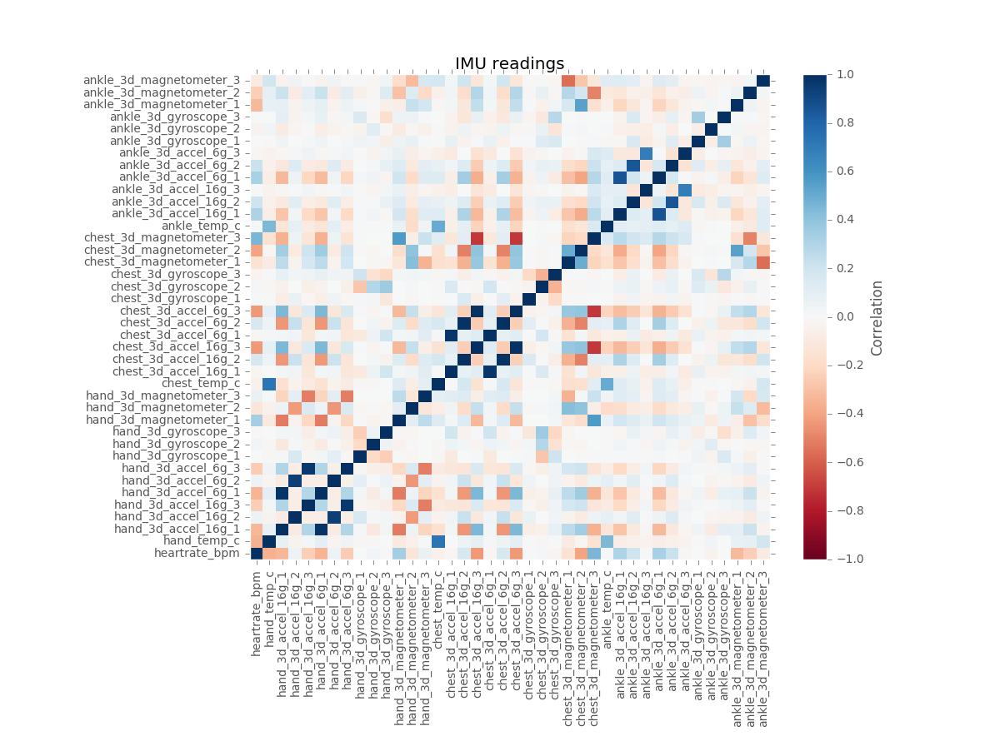

# Proposal

## Problem Description
Wearable technologies are getting more and more common and machine learning plays an important role in enabling the machine to recognize a person's activity. While typical machine learning projects seeks to classify the activity performed, this project attempts to go a step further and aims to develop a method to best classify the activity and the person performing the activity. Using the T,P,E framework, the problem can be summarized into:

* **Task** - Predict the activity *and* the person performing the activity
* **Performance** - Number of actions *and* person performing the activity correctly classified
* **Experience** - PAMAP2 data set of labeled IMU readings available from the UCI Machine Learning Repository 

## Approach

The approach undertaken by this project would be to compare 3 different models in the classification of human activity and the person performing it. The 3 models that will be compared are summarised as follows:

1. **Model 1** - Classify Subject (Person) --> Feed subject back into model to classify action of the subject
2. **Model 2** - Classify Action --> Feed action back into model to the classify subject
3. **Model 3** - Classify both subject and action simultaneously

The most suitable model (in terms of accuracy, precision and recall) to classify an activity that is carried out by a unique individual will be selected. Supervised learning methods will explored and used to construct the model. The model will then be interpreted to extract insights on how are the actions and subjects classified. 

Hold-out or k-fold cross validation will be used to avoid over-fitting the model. The final cross validation method will be decided later. 

Source control will be done using Github. 

## Data Set

The Physical Activity Monitoring for Aging People (PAMAP) organisation collected the data of 9 subjects. The 9 subjects (8 males, 1 female) who participated were mainly employees or students at the German Research Center for Artificial Intelligence (Deutsches Forschungszentrum für Künstliche Intelligenz, DFKI). They are aged between 27 and 31 years old and have BMIs between 25kgm^-2 and 28kgm^-2. 

The 9 subjects carried out 18 different physical activities in a controlled environment - all subjects went through the exact same sequence of activities with optional activities performed by some of the subjects. Optional activities will not be in the scope of this project. The data collection was done by attaching 3 [Colibri wireless inertial measurement units (IMUs)] (http://www.trivisio.com/index.php/products/motiontracking/colibriwireless) to 3 main parts of each subject's body - the wrist of the dominant arm, the chest, and the ankle of the dominant leg.

The full data set exists in 9 separate .dat files of 54 columns, one for each subject and the data collected can be classified in the following categories:

Column # | Data
--- | ---
1 | Timestamp (s)
2 | Activity ID
3 | Heart rate (bpm)
4 - 20 | IMU Hand
21 - 37 | IMU Chest
38 - 54 | IMU ankle

Each IMU sensory data (hand, chest and ankle) contains the following:

* Temperature
* 3D acceleration data
* 3D gyroscope data
* 3D magnetometer data
* Orientation (this is invalid in this dataset)

These activities can be classified as follows:

ID | Activity
--- | ---
1 | Lying
2 | Sitting
3 | Standing
4 | Walking
5 | Running
6 | Cycling
7 | Nordic walking
9 | Watching TV
10 | Computer work
11 | Car driving
12 | Ascending stairs
13 | Descending stairs
16 | Vacuum cleaning
17 | Ironing
18 | Folding Laundry
19 | House cleaning
20 | Playing soccer
24 | Rope Jumping
0 | Other (Transient activities)

## Initial Data Exploration & Preparation
As the data set exists in 9 separate .dat files a script was prepared to read the data and consolidate it into one .txt file for easier processing. As an one-time filtering, activities that are performed by less than 6 subjects and activities performed for only a few seconds (i.e 24 - Rope Jumping) were removed. Optional activities resides in separate data files and are not read. Each of the record was also labeled with the subject performing the activity as part of the initial and consolidation. 

A summary of the number of records and columns is provided below. 

* Total Records Read From Original Data Set:  2872533
* Total Records Written to Consolidated Data Set:  1893512
* Total Records Filtered:  979021
* total Columns in Consolidated Data Set: 55

A summary of the data was performed using the Python pandas package and initial exploration of the data set reveals several important points that will provide the basis for training the models:

Exploration item | Remarks & Potential implication
---|---
Subject 9 has significantly lower amounts of recorded data than the other subjects | Including the subject will severely distort the analysis as he is an obvious outlier. As such, we exclude subject 9 from our analysis.
The data set consists of a significant amount of NaN data | Cannot conduct PCA with missing values. There are missing values mainly because of technical issues and the fact that heart rate and other recorded variables were measured at different frequencies. As such, we have to handle the missing data.
Timestamps are available | Including the timestamp in the analysis will cause the model to be biased - it is possible to predict results solely based on timestamps as subjects performed the activities in a sequence. As such, we have to exclude timestamps.
Some activities were only carried out by a few subjects (e.g. watching TV was only carried out by 1 subject) | Activities carried out by less than 6 out of 8 subjects should be left out in order to train the model properly. 

Some of the attributes were also found to be highly correlated. 

**Correlation Matrix of the variables**

3D Accelerators (16g) are highly correlated (postively) with 3D Acclerators (6g); 3D Magnetometer (Chest) highly correlated (negatively) with both 3D accelerometers (Chest)

As such, further exploration will be needed and the data and any implications will need to be considered wen constructing the models. 
