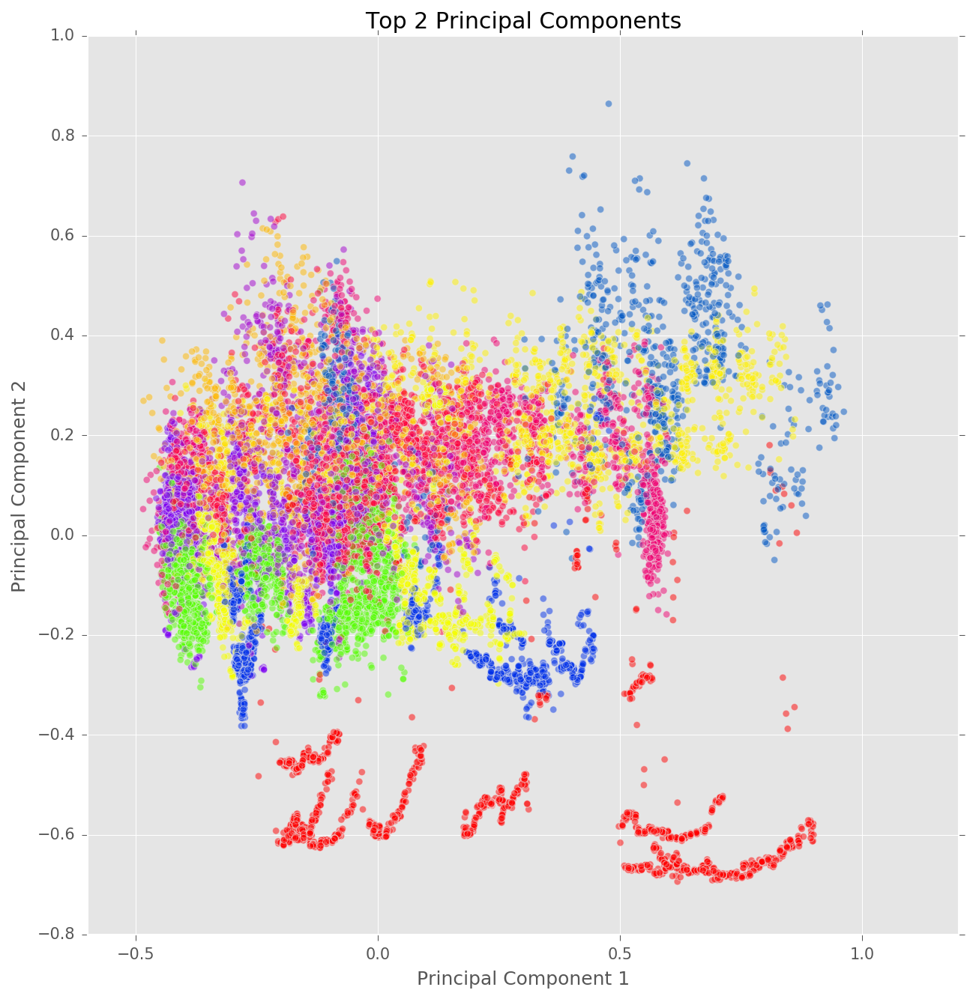

# Report

## Introduction

Wearable technologies are getting more and more common and machine learning plays an important role in enabling the machine to recognize a person's activity. With some physical parameters measurement of human body, a computer is smart enough to tell the activity carried out by a person, i.e. sitting, running or climbing up stairs. The constructed model may be deployed in a health care setting, to monitor a patient's activities. With the ability to differentiate the activities and the person performing it, it also opens up the possibility of sharing the wearable device. Typical machine learning projects seeks to classify the activity performed, this project attempts to go a step further and aims to develop a method to best classify the activity and the person performing the activity. Using the T,P,E framework, the problem can be summarized into:

* **Task** - Predict the activity *and* the person performing the activity
* **Performance** - Percentage of actions *and* person performing the activity correctly classified
* **Experience** - PAMAP2 data set of labeled IMU readings available from the UCI Machine Learning Repository

## Objective

The objective of this project is to evaluate empirically the performance of various machine learning algorithms in terms of the time taken to train the model, accuracy, precision and recall. The project also aims to empirically evaluate the performance of methodology used to predict both the activity and subject. For the above objectives, a few classifier models have been built and compared. They are namely, the Naive Bayes classifier, Support Vector Machine classifier, Logistic Regression classifier.

## Approach

The approach that we propose would be to first explore in detail to extract the features most representative of the activities and the subject. Next, 3 different models will be compared in the classification of human activity and the person performing it. The 3 models that will be compared are summarised as follows:

1. **Model 1** - Classify Subject (Person) --> Feed subject back into model to classify action of the subject
2. **Model 2** - Classify Action --> Feed action back into model to the classify subject
3. **Model 3** - Classify both subject and action simultaneously

The most suitable model (in terms of accuracy, precision and recall) to classify an activity that is carried out by a unique individual will be selected. Supervised learning methods will explored and used to construct the model. The model will then be interpreted to extract insights on how are the actions and subjects classified.

Hold-out and k-fold cross validation were used for model validation. Source control will be done using Github.

## About the Data Set

The PAMAP2 data set available from UCI Machine Learning Repository [(Link)](https://archive.ics.uci.edu/ml/datasets/PAMAP2+Physical+Activity+Monitoring) consist the data collected from 9 subjects(persons).

These 9 subjects are mainly employees or students at DFKI and consists of
* 1 female, 8 males
* aged 27.22 ± 3.31 years
* BMI 25.11 ± 2.62 kgm-2

Each subject performs 12 different physical activities such as sitting, lying, walking and running in a controlled environment - all went through the exact same sequence of activities. In addition, 6 optional activities were performed by some of the subjects. In this project optional activities will be out of the scope.

The 12 activities in scope for this projects are:
* Lying
* Sitting
* Standing
* Ironing
* Vacuuming
* Walking upstairs
* Walking downstairs
* Normal walk
* Nordic walk
* Cycling
* Running
* Rope Jumping

It is noted that all above 12 activities are the most commonly daily activities, except Nordic walk which requires a person to walk with specially designed walking poles. The data are collected via a heart rate monitor and 3 Colibri wireless inertial measurement units (IMUs) attached to each subject's body: one over the wrist, one on the chest and one on ankle.

The heart rate monitor has sampling rate of 9Hz and each IMU generate following data with 17 columns:

* 1 temperature (°C)
* 2-4 3D-acceleration data (ms-2), scale: ±16g, resolution: 13-bit
* 5-7 3D-acceleration data (ms-2), scale: ±6g, resolution: 13-bit
* 8-10 3D-gyroscope data (rad/s)
* 11-13 3D-magnetometer data (μT)
* 14-17 orientation

The full data set exists in 9 separate .dat files, one for each subject, of 54 columns (17 columns x 3 IMU + Heart Rate + Activity ID + Time Stamp). Orientation data is also included in the data set but invalid in this data set as mentioned in the code book available with the PAMAP2.

## Data Preparation

**Missing Values** - The missing values were caused by lost of signals. As such, missing values are populated with the last valid value for the subject and if there is no valid value before, the first valid value after the record was used. This was done for each subject's data.

**Invalid Data** - Orientation is not valid in this data set as stated in the code book and was removed. Accelerometer data for with the scale of ±6g was also removed from the data set as recommended by the code book as readings are saturated for high impact movements such as running.

## Data Exploration

### Univariate Exploration

**Univariate Distributions**

It can be observed that the `heartrate_bpm`, and temperature readings such as `hand_temp_c`, `chest_temp_c` and `ankle_temp_c`, and the magnetometer readings have a greater variance in their distributions as compared to the accelerometer and gyroscopic readings. As such, we would expect these variables to have a greater impact on the classification models.

---

### Bivariate Exploration

**Pair-wise Correlation Plot**

The correlation shows a strong correlations between several variables, some of which are:

* `chest_temp_c` and `hand_temp_c`
* `chest_3d_magnetometer` and `chest_3d_accel`
* `ankle_3d_magnetometer` and `chest_3d_magnetometer`

The correlations between several of these variables are relatively strong (around 0.5 and above). As such, it would be interesting to reduce dimensionality based on correlation, using PCA, to further explore.

---

### PCA

PCA was conducted on the dataset to reduce dimensionality and the 2 variables `subject` and `activity_id` were concatenated into one target variable `subj_activity` for easier visualisation.

** First Principal Component (PC1) **

PC1 has a strongest correlation with `chest_temp_c` (negative), `hand_temp_c` (negative), and `ankle_temp_c` (negative).

## Model Comparison

Given the classification problems and methodologies. We used several models to classify the dataset. In choosing the best model, we applied the following criteria:

* Accuracy: Number of correctly predicted classes over total number of actual classes.
* Computational Complexity: The amount of time taken, or estimated amount of time taken if not successfully run, was used as a proxy.

The classifiers used were the following:

* SVM with Stochastic Gradient Descent (SGD)
* Gaussian Naive Bayes
* Multi-output Classifier using the best model from initial comparison

The approach taken can be generalized as such, based on the methodology above:

1. Split data using Stratified Shuffle Split
2. Perform PCA to reduce dimensionality
3. Train model (Time recorded)
4. Predict and score
5. Repeat for 3 methods:
  * Subject > Activity (S > A)
  * Activity > Subject (A > S)
  * Both

### Initial Comparison

Due to the large sample size, SVM using SGD learning was our first model. Being an efficient model, runtime would be fast and we would get a quick feel of how the model performed. Note that PCA was not carried out in this case. It has been proven that RBF kernel is not suitable in cases where the number of features is large - a linear kernel would be more suitable[1].

The models were first ran at a fixed alpha of 0.1 to get a benchmark. The results of running the model using the 3 methods are as follows:

Method | Accuracy | Time Taken (seconds)
--- | ---
S > A | 0.51 | 15.97, 12.53
A > S | 0.46 | 15.92, 12.93
Both | 0.59 | 113.75

We can see that predicting both targets together produced best results. We took this further and used Grid Search Cross Validation was used to find the level of smoothing that produced the best results under the 'Both' condition.

The best model selected from the Grid Search produced an accuracy of **0.65** at `alpha = 0.01`, which took **50.1** seconds to train.

The Gaussian Naive Bayes is generative model that is based on very simplistic calculations to calculate posterior probability. As such, it would be very efficient. Further, it is well-known that Gaussian Naive Bayes has been performant in real-world situations despite its unrealistic assumption of conditional independence. Therefore, we next used Gaussian Naive Bayes with scaling and PCA. The choice to scale prior to conducting PCA was because the variables were measured on different scales (e.g. Heartrate in beats per minute vs. Chest temperature in Celsius). Also, scaling before PCA has been shown to produce better results[2].

Method | Accuracy | Time Taken (seconds)
--- | ---
S > A | 0.40 | 0.63, 0.63
A > S | 0.50 | 0.63, 0.59
Both | 0.64 | 0.95

The efficiency of the model is evident in the time taken to train and test the model. It is more than 10 times faster than the SVM model in the S > A and A > S conditions and over 100 times faster under the 'Both' condition. Interestingly, Gaussian Naive Bayes does not necessarily outperform the tuned SVM model with SGD. However when we account for the efficiency of the model, it puts Gaussian Naive Bayes slightly ahead as its accuracy is almost on par to that of the SVM model.

However, it is also important to note that Gaussian Naive Bayes is considered relatively immune to the 'Curse of Dimensionality'. This is largely due to its simplicity. Given this, it would be interesting to observe the model's performance using the original data, without PCA.

As such, we ran Gaussian Naive Bayes model with scaling, but without PCA.

Method | Accuracy | Time Taken (seconds)
--- | ---
S > A | 0.54 | 1.36, 1.27
A > S | 0.54 | 1.43, 1.48
Both | 0.96 | 1.81

The model under the 'Both' condition produced a whopping 0.96 accuracy with a slight drop in efficiency compared to its counterpart with PCA, presumably due to the increase in number of features used for training. The decrease in efficiency is not significant when compared to the increase in accuracy. This disproportionate trade-off in favour of accuracy has made this model an attractive one for our case.

As such, we selected this model to be our final model to be compared with a multi-output classifier shipped with Scikit-learn.

### Final Comparison

In this comparison, the main objective is to compare the performance of two algorithms that theoretically aim to do the same thing. The difference is in the details where the 'Both' condition predicts a concatenated target variable, essentially converting the problem into a binary classification problem, while the Multi-output Classifier still considers multiple target variables (in this case 2) and predicts them together.

The Gaussian Naive Bayes model with Multi-output Classifier produced an accuracy of **0.54** which took a duration of **2.75** seconds. This is significantly less performant than the standard classifier.

The difference in performance could simply be the difference between the strategy adopted by the Multi-output Classifier inherent in the code.

### Misc

An interesting point to note is that the 'Both' condition consistently performed better than the other two methods across all models. Upon close consideration, this can be said to be an expected result. When predicting one target variable after the other, the errors made in predictions stack up. For example, in the case of S > A, the errors made in first predicting `'subject'` would then be carried over to wrongly predict `'activity_id'` as `'subject'` becomes part of the variable used to predict A.

## Conclusion

Generalising this beyond the context of this dataset, this study has shown a few key points in comparing methods of classifying multi-output problems.

* Gaussian Naive Bayes model without PCA tends to perform better, in terms of both accuracy and efficiency. This is especially so when sample size is large.

* Concatenating the multiple outputs into one target variable with more unique levels performs better than trying to predict the target variables as standalone outputs.

## References

[1] Hsu, et al (2016), [*A Practical Guide to Support Vector Classification*](http://www.csie.ntu.edu.tw/~cjlin/papers/guide/guide.pdf)
[2] Raschka S. (2014), [*About Feature Scaling and Normalization*](http://sebastianraschka.com/Articles/2014_about_feature_scaling.html)

---

Things that came up during discussions with prof

Potential Techniques
* Potential techniques not required in proposal yet
* Principle Component Analysis
* Decision Trees (may some ensemble?)
* SVM ?

Things to do
* Predict the person
* Predict the activity
* Make the prediction 2 layers
* first layer to classify the person
* second layer to classify the activity
* can also do a joint classifier
* Need to interpret classifier (eg. speed to determine whether person is walking or running)
* for eg. what dimension needs to
