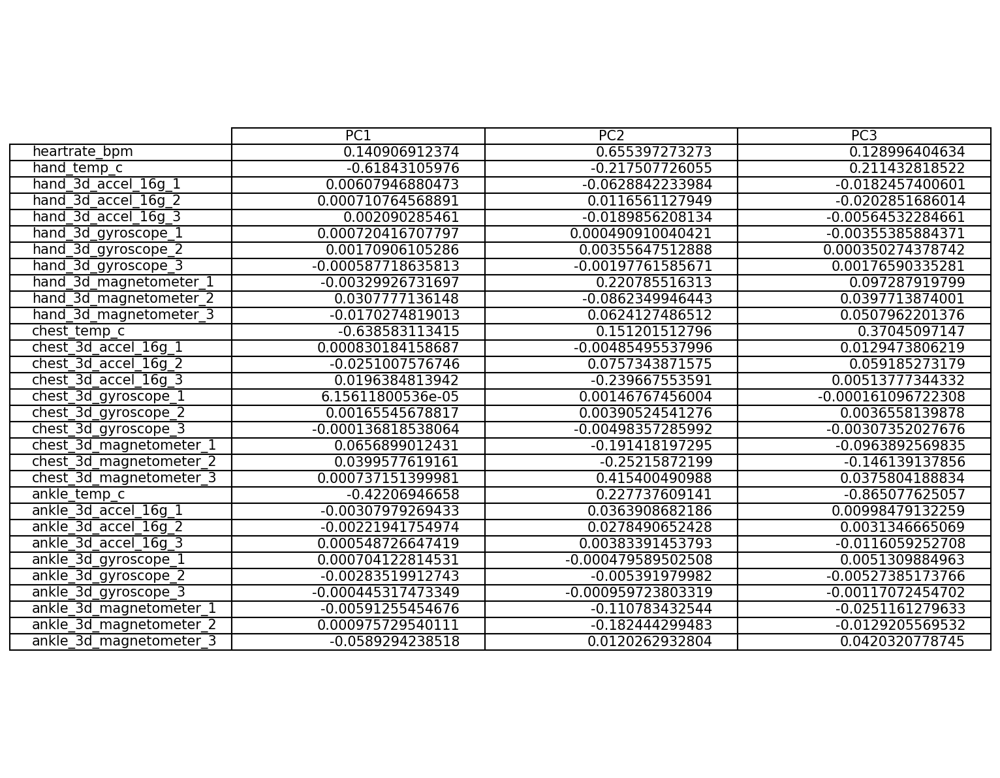

# Report

## Introduction

Wearable technologies are getting more and more common and machine learning plays an important role in enabling the machine to recognize a person's activity. With some physical parameters measurement of human body, a computer is smart enough to tell the activity carried out by a person, i.e. sitting, running or climbing up stairs. The constructed model may be deployed in a health care setting, to monitor a patient's activities. With the ability to differentiate the activities and the person performing it, it also opens up the possibility of sharing the wearable device. Typical machine learning projects seeks to classify the activity performed, this project attempts to go a step further and aims to develop a model to best classify the activity and the person performing the activity. Using the T,P,E framework, the problem can be summarized into:

* **Task** - Predict the activity *and* the person performing the activity
* **Performance** - Percentage of actions *and* person performing the activity correctly classified
* **Experience** - PAMAP2 data set of labeled IMU readings available from the UCI Machine Learning Repository

## Objective

The objective of our project is to evaluate empirically the performance of various machine learning algorithms in terms of the time taken to train the model, accuracy, precision and recall. Our project also aims to empirically evaluate the performance of methodology used to predict both the activity and subject. We will be using Gaussian Naive Bayes and Support Vector Machines in this project. The reasons for these choices will be explained below.

## Approach

Detailed exploration will be done to understand the data set in terms of the distribution of data and the components
that explain the most variance. 3 different model construction approaches will then be compared in the classification of human activity and the person performing it. The 3 model construction methods that will be compared are summarised
 as follows:

**Model Construction Methods**

1. Classify Subject (Person) --> Feed subject back into model to classify action of the subject
2. Classify Action --> Feed action back into model to the classify subject
3. Classify both subject and action simultaneously

The model will be selected based on accuracy, precision and recall as well as the computational complexity of training the model. Computational complexity is often an important factor in deploying a model. Supervised learning methods will explored and used to construct the model. The model will then be interpreted to extract insights on how are the actions and subjects classified.

Hold-out and k-fold cross validation were used for model validation. Source control will be done using Github.

## About the Data Set

The PAMAP2 data set available from UCI Machine Learning Repository [(Link)](https://archive.ics.uci.edu/ml/datasets/PAMAP2+Physical+Activity+Monitoring) consist the data collected from 9 subjects (persons). These 9 subjects are mainly employees or students at German Research Center for Artificial Intelligence (DFKI) and each subject performs 12 different physical activities such as sitting, lying, walking and running in a controlled environment - all went through the exact same sequence of activities. In addition, 6 optional activities were performed by some of the subjects. In this project optional activities will be out of the scope. The activities performed by each subject is summarized into the table below.

The 11 activities in scope for this projects are:
* Lying
* Sitting
* Standing
* Ironing
* Vacuuming
* Walking upstairs
* Walking downstairs
* Normal walk
* Nordic walk
* Cycling
* Running

It is noted that all above 11 activities are the most commonly daily activities, except Nordic walk which requires a person to walk with specially designed walking poles. The data are collected via a heart rate monitor and 3 Colibri wireless inertial measurement units (IMUs) attached to each subject's body: one over the wrist, one on the chest and one on ankle.

The heart rate monitor has sampling rate of 9Hz and each IMU generate following data with 17 columns:

* 1 temperature (°C)
* 2-4 3D-acceleration data (ms-2), scale: ±16g, resolution: 13-bit
* 5-7 3D-acceleration data (ms-2), scale: ±6g, resolution: 13-bit
* 8-10 3D-gyroscope data (rad/s)
* 11-13 3D-magnetometer data (μT)
* 14-17 orientation

## Data Preparation

As the data set exists in 9 separate .dat files a script was prepared to read the data and consolidate it into one .txt file for easier processing. As an one-time filtering, activities that are performed by less than 6 subjects and activities performed for only a few seconds (i.e 24 - Rope Jumping) were removed. Optional activities resides in separate data files and are not read. Each of the record was also labeled with the subject performing the activity as part of the initial and consolidation.

**Missing Values** - The missing values were either caused by the lost of signals or the different frequencies the monitors record the data. As such, missing values are populated with the last valid value for the subject and if there is no valid value before, the first valid value after the record was used. This was done for each subject's data.

**Invalid Data** - Orientation is not valid in this data set as stated in the code book and was removed. Accelerometer data for with the scale of ±6g was also removed from the data set as recommended by the code book as readings are saturated for high impact movements such as running.

**Derived Subject-Activity** - An additional variable was created to concatenate subject and activity such that
subject-activity is made up of 5 digits with the formula `(100 * subject) + activity`. For example a person with
subject 101 performing activity 12 will be derived as (100*101) + 12 = 10112.

After data cleansing and preparation, the total records used for training and testing the model is 1,893,511.

## Data Exploration

### Univariate Exploration

We explore the properties of each feature to observe for any special trends. We do so by observing the distributions of each variable.

**Univariate Distributions**

It can be observed that the `heartrate_bpm`, and temperature readings such as `hand_temp_c`, `chest_temp_c` and `ankle_temp_c`, and the magnetometer readings have a greater variance in their distributions as compared to the accelerometer and gyroscopic readings. As a rule of thumb, we would expect the variables with more variance to have a greater impact on the predictive power of the model.

It is also interesting to observe that `hand_temp_c`, `chest_temp_c` and `ankle_temp_c` have very similar distributions which are slightly left-skewed. On the other hand, `heartrate_bpm` has a slightly right-skewed distribution. We can expect that the temperature readings and `heartrate_bpm` to have opposing effects.

---

### Bivariate Exploration

Next, we look into the pair-wise correlations between the variables to look out for any strong correlations which may affect the construction of the model. For easier visualisation, we plot a pair-wise correlation plot.

**Pair-wise Correlation Plot**

The correlation shows a strong correlations between several variables, some of which are:

* `chest_temp_c` and `hand_temp_c`
* `chest_3d_magnetometer` and `chest_3d_accel`
* `ankle_3d_magnetometer` and `chest_3d_magnetometer`

The correlations between several of these variables are relatively strong (around 0.5 and above). On the other hand, we can also see that most of the variables are not very strongly correlated with each other. This goes to show that each variable could each contribute to the prediction of the model. However, when relating back to the univariate exploration, we would not expect many of these variables to have strong effects on the predictions due to the lack of variance in their distributions.

---

### Principal Component Analysis (PCA)

Given the number of features, we thought it would be important to conduct a PCA to observe for any further interesting properties about the dataset. PCA was conducted on the dataset to reduce dimensionality and the 2 variables `subject` and `activity_id` were concatenated into one target variable `subj_activity` for easier visualisation.

We can see from the Scree Plot that most of the variance can be explained by the first 3 components as there is a sharp kink in the Scree curve around that point.

The top 3 principal components along with their correlation with the original variables are shown in the table below.

**First Principal Component (PC1)**

We can see that PC1 has the strongest correlations with `chest_temp_c` (negative), `hand_temp_c` (negative), and `ankle_temp_c` (negative). This is not surprising as we relate this back to our univariate analysis in that the 3 variables had high degrees of variance. Also, their distributions were similar - explaining the negativity of the correlations with PC1. Also, it is interesting to note that `heartrate_bpm` has a positive correlation with PC1, but to a smaller degree when compared to the temperature variables. This can be explained by the opposing skews in their distributions. It is expected that `heartrate_bpm` and the temperature variables have opposing correlations. We can conclude that PC1 is characterised and affected strongly by temperatures of different body parts of each subject.

**Second Principal Component (PC2)**

Interestingly, `heartrate_bpm` has the strongest correlation with PC2 out of all the variables. Other variables that have considerable correlation with PC2 are the magnetometer readings from the hand and chest, with chest having a higher correlation than that of the hand. Magnetometers measure to magnetism around the area where they are attached to. In this case, both `heartrate_bpm` and `chest_3d_magnetometer` had positive correlations with PC2. With more movement and activity, comes stronger noise and readings measured by the magnetometer attached onto the chest. Also, we can observe that the 3 temperature variables have positive correlations with PC2, hinting that they, along with heart rate, will cause an increase in PC2 when they have higher readings. Consequently, we would also expect higher heart rates. As such, PC2 seems to be explained mostly by the amount of activity the chest and the heart are engaged in, and we can expect both of them to be closely related. This will be bolstered by the fact that greater activity in the human body will generate more heat, causing an overall increase in body temperature.

At this point, we can take a look at the interactions between PC1 and PC2, coloured by `subj_activity`.

We can see that there is a high degree of overlap between different levels of `subj_activity` with some obvious outliers which seemingly form their own cluster based on visual observation. We continue to analyze PC3 to see its impact on the data.

**Third Principal Component (PC3)**

In this PC, `ankle_temp_c` has the strongest correlation of around -0.865. The next variable in line would be `hand_temp_c` with only 0.211 correlation with PC3. Closer inspection into the PC reveals that `ankle_temp_c` dominates this PC. We take a look at its effect when a plot is generated with PC1 and PC2.

We can see that the number of obvious outliers has decreased drastically with the inclusion of PC3. PC3, characterised by its inverse relationship with the ankle temperature, seemingly 'brought in' the outliers.

After analysing the principal components, we are now ready to create and compare our models.

## Model Comparison

Given the classification problems and methodologies. We used several models to classify the data set. In choosing the best model, we applied the following criteria:

* **Accuracy**: Number of correctly predicted classes over total number of actual classes.
* **Computational Complexity**: The amount of time taken, or estimated amount of time taken if not successfully run, was used as a proxy.

The classifiers used were the following:

* SVM with Stochastic Gradient Descent (SGD)
* Gaussian Naive Bayes
* Multi-output Classifier using the best model from initial comparison

The approach taken can be generalized as such, based on the methodology above:

1. Split data using Stratified Shuffle Split
2. Perform PCA to reduce dimensionality (optional)
3. Train model
4. Predict
5. Output training duration and scores
6. Output test scores
7. Repeat for 3 model construction methods:
  * Subject -> Activity (S -> A)
  * Activity -> Subject (A -> S)
  * Both

#### Support Vector Machines

Due to the large sample size, SVM using SGD learning was our first model. Being an efficient model, runtime would be fast and we would get a quick feel of how the model performed. Note that PCA was not carried out in this case. It has been proven that RBF kernel is not suitable in cases where the number of features is large - a linear kernel would be more suitable[1].

SVM without using SGD with a linear kernel was also ran to have a gauge of the time needed to train the model.

Fitting the model took upwards of 5 hours on a machine with xxxxx core and did not complete successfully.   

SVM using SGD algorithm were first ran at a fixed alpha of 0.1 to get a benchmark. The models were trained for a 100 times each due to the fact that SGD may encounter a local minima. The mean, maximum and minimum accuracy scores are shown for each of the methods are shown below.

Method | Accuracy (mean) | Accuracy (max) | Accuracy (min) | Average Time Taken (seconds)
--- | --- | --- | --- | ---
S -> A | 0.xx | 0.00 | 0.00 | 15.97 + 12.53 =
A -> S | 0.xx | 0.00 | 0.00 | 15.92, 12.93 =
Both | 0.xx | 0.00 | 0.00 | 113.75

We can see that predicting both targets together produced best results. We took this further and used Grid Search Cross Validation was used to find the level of smoothing that produced the best results under the 'Both' condition.

Similarly, the model was trained for a 100 times. Furthermore, a 2-fold cross validation was done during training. The mean, maximum and minimum accuracy scores are shown for each of the methods are shown below.

Method | Accuracy (mean) | Accuracy (max) | Accuracy (min) | Average Time Taken (seconds)
--- | --- | --- | --- | ---
S -> A | 0.xx | 0.00 | 0.00 | 15.97 + 12.53 =
A -> S | 0.xx | 0.00 | 0.00 | 15.92, 12.93 =
Both | 0.xx | 0.00 | 0.00 | 113.75

The best model selected from the Grid Search produced an accuracy of **0.65** at `alpha = 0.01`, which took **50.1** seconds to train.

#### Gaussian Naive Bayes

The Gaussian Naive Bayes is generative model that is based on very simplistic calculations to calculate posterior probability. As such, it would be very efficient. Further, it is well-known that Gaussian Naive Bayes has been performant in real-world situations despite its unrealistic assumption of conditional independence. Therefore, we next used Gaussian Naive Bayes with scaling and PCA. The choice to scale prior to conducting PCA was because the variables were measured on different scales (e.g. Heartrate in beats per minute vs. Chest temperature in Celsius). Also, scaling before PCA has been shown to produce better results[2].

Method | Accuracy | Time Taken (seconds)
--- | --- | ---
S > A | 0.40 | 0.63 + 0.63
A > S | 0.50 | 0.63 + 0.59
Both | 0.64 | 0.95

The efficiency of the model is evident in the time taken to train and test the model. It is more than 10 times faster than the SVM model in the S > A and A > S conditions and over 100 times faster under the 'Both' condition. Interestingly, Gaussian Naive Bayes does not necessarily outperform the tuned SVM model with SGD. However when we account for the efficiency of the model, it puts Gaussian Naive Bayes slightly ahead as its accuracy is almost on par to that of the SVM model.

However, it is also important to note that Gaussian Naive Bayes is considered relatively immune to the 'Curse of Dimensionality'. This is largely due to its simplicity. Given this, it would be interesting to observe the model's performance using the original data, without PCA. As such, we ran Gaussian Naive Bayes model again, but without PCA.

Method | Accuracy | Time Taken (seconds)
--- | --- | ---
S > A | 0.54 | 1.36, 1.27
A > S | 0.54 | 1.43, 1.48
Both | 0.96 | 1.81

The model under the 'Both' condition produced an accuracy of 0.96 with a slight drop in efficiency compared to its counterpart with PCA, presumably due to the increase in number of features used for training. The decrease in efficiency is not significant when compared to the increase in accuracy. This disproportionate trade-off in favour of accuracy has made this model an attractive one for our case.

As such, we selected this model to be our final model to be compared with a multi-output classifier shipped with `sklearn`.

#### Comparison with Multi-Output Classifier

In this comparison, the main objective is to compare the performance of two algorithms that theoretically aim to do the same thing. The difference is in the details where the 'Both' condition predicts a concatenated target variable, essentially converting the problem into a binary classification problem, while the Multi-output Classifier still considers multiple target variables (in this case 2) and predicts them together. The multi-output classifier classifies by fitting 1 classifier per target. In our case, 1 classifier will be fitted to predict Activity and 1 classifier will be fitted to predict Subject. The result of multi-output is shown below.

Method | Accuracy | Time Taken (seconds)
--- | --- | ---
Multi-Output | 0.96 | 1.81

The Gaussian Naive Bayes model with Multi-output Classifier produced an accuracy of **0.54** which took a duration of **2.75** seconds. This is significantly less performant than the standard classifier.

The difference in performance could simply be the difference between the strategy adopted by the Multi-Output
Classifier.

#### K-fold Cross Validation

The k-fold cross validation was also performed to evaluate the Gaussian Naive Bayes model in addition to the hold-out method used earlier. k-fold was used in addition to the hold-out method due to the fact that with k-fold, the evaluation of the model is less impacted by how the data is divided. `StratifiedKFold` from `sklearn` was used due to the unbalanced classes we are trying to predict.

 10-fold cross validation was used and the average accuracy of the Gaussian Naive Bayes model predicting both Subject and Activity at the same time is:

 This is similar to the results earlier.

#### Visualizing the Classifications

To understand how the Gaussian Naive Bayes classify the data set, the principal components and the temperatures were visualized with the classes predicted.

* Colors denote the various subject - activities
* Circles denote correctly predicted classes
* Inverted triangles denote incorrectly predicted classes

## Conclusion

## Discussions

Generalising this beyond the context of this dataset, this study has shown a few key points in comparing methods of classifying multi-output problems.
* Gaussian Naive Bayes model without PCA tends to perform better, in terms of both accuracy and efficiency. This is especially so when sample size is large.
* Concatenating the multiple outputs into one target variable with more unique levels performs better than trying to predict the target variables as standalone outputs.

An interesting point to note is that the 'Both' condition consistently performed better than the other two methods across all models. Upon close consideration, this can be said to be an expected result. When predicting one target variable after the other, the errors made in predictions stack up. For example, in the case of S > A, the errors made in first predicting `'subject'` would then be carried over to wrongly predict `'activity_id'` as `'subject'` becomes part of the variable used to predict A.

## References

[1] Hsu, et al (2016), [*A Practical Guide to Support Vector Classification*](http://www.csie.ntu.edu.tw/~cjlin/papers/guide/guide.pdf)

[2] Raschka S. (2014), [*About Feature Scaling and Normalization*](http://sebastianraschka.com/Articles/2014_about_feature_scaling.html)
